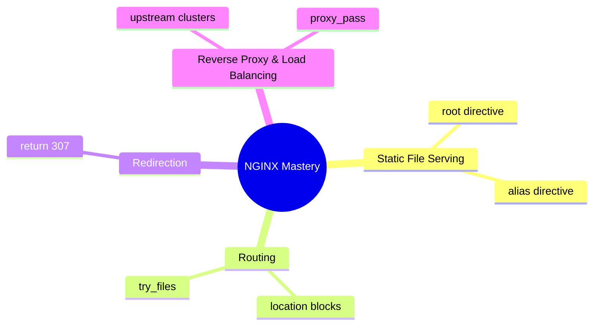

# NGINX Learning Journey

Here is a visual breakdown of all the NGINX core concepts we've covered in our project, followed by a quick cheat sheet for each!

## Concept Mind Map

## Concept Explanations

> [!NOTE]
> **Static Files: `root` vs `alias`**
> When you need NGINX to serve HTML/CSS files from your hard drive, you have two choices:
> - **`root`**: Appends the URL location to the directory path. If you ask for `/fruit`, it looks for a folder named `fruit` inside your root directory.
> - **`alias`**: Maps the URL location directly to the directory path. If you ask for `/fruit`, it looks directly inside the alias directory, ignoring the word "fruit".

> [!TIP]
> **Routing & Fallbacks: `try_files`**
> Think of `try_files` as an "if-else" statement for files. NGINX checks paths in the exact order you provide.
> - **Syntax**: `try_files /file1.html /file2.html =404;`
> - **Why it's useful**: If a user requests a file that doesn't exist, you can gracefully fall back to a default `index.html` page instead of throwing a generic error.

> [!IMPORTANT]
> **Redirections: `return`**
> Intercepts the user's request and tells their browser to navigate to a different URL.
> - **Syntax**: `return 307 /fruit;`
> - **Why it's useful**: Perfect for when you restructure your website or want to redirect users from HTTP to HTTPS. The `307` code tells the browser "this is a temporary move".

> [!TIP]
> **Load Balancing: `upstream` & `proxy_pass`**
> This is what allows massive websites to stay online! NGINX acts as a traffic cop (Reverse Proxy).
> - **`upstream`**: You define a group of backend servers (like your 3 Node.js Docker containers).
> - **`proxy_pass`**: You forward incoming traffic to that upstream group. NGINX will automatically distribute the load using algorithms like Round-Robin!
