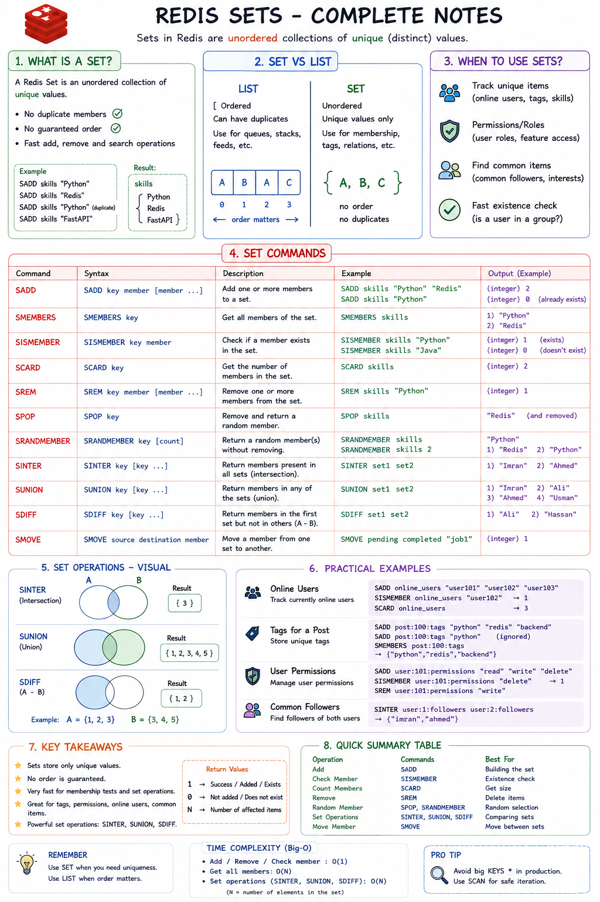

Absolutely bro. 🔥 **Redis Sets** are the next important data structure. And they're actually very easy once you understand the one rule that makes them different from Lists.

# 🟢 Redis Sets

## 1. What is a Set?

A Redis **Set** is an **unordered collection of unique values**.

The two important properties are:

```text
SET
├── ❌ No duplicates
└── ❌ No guaranteed order
```

For example:

```redis
SADD skills "Python"
SADD skills "FastAPI"
SADD skills "Redis"
SADD skills "Python"
```

The final Set is conceptually:

```text
skills
   │
   ├── Python
   ├── FastAPI
   └── Redis
```

`Python` was added twice, but Redis keeps it **only once**.

---

# 2. Set vs List

This distinction is VERY important.

### List

```text
[Python, Redis, Python, FastAPI]
```

Duplicates are allowed.

Order matters.

### Set

```text
{Python, Redis, FastAPI}
```

Duplicates aren't allowed.

Order doesn't matter.

So:

> **List = ordered collection that can contain duplicates**

> **Set = unordered collection of unique values**

---

# 3. Creating a Set — `SADD`

`SADD` = **Set Add**

```redis
SADD skills "Python"
```

Add multiple values:

```redis
SADD skills "FastAPI" "Redis" "Docker"
```

Now:

```redis
SMEMBERS skills
```

might give:

```text
1) "Python"
2) "FastAPI"
3) "Redis"
4) "Docker"
```

The exact order isn't something you should rely on.

---

# 4. `SMEMBERS`

`SMEMBERS` means:

> Give me **all members** of this Set.

```redis
SMEMBERS skills
```

Think:

```text
SMEMBERS
   ↓
Show me everything inside the Set
```

---

# 5. Duplicates — The Important Part

Try this:

```redis
SADD languages "Python"
SADD languages "Python"
SADD languages "Python"
```

Now:

```redis
SMEMBERS languages
```

You'll still have:

```text
1) "Python"
```

Redis doesn't create three copies.

You can also check whether something was actually added:

```redis
SADD languages "Python"
```

If `Python` is new:

```text
(integer) 1
```

If it already exists:

```text
(integer) 0
```

That's useful!

---

# 6. `SISMEMBER`

Want to ask:

> "Is Python inside this Set?"

Use:

```redis
SISMEMBER languages "Python"
```

Result:

```text
(integer) 1
```

`1` means **yes**.

Try:

```redis
SISMEMBER languages "Java"
```

Result:

```text
(integer) 0
```

So:

```text
1 → member exists
0 → member doesn't exist
```

---

# 7. `SCARD`

`SCARD` tells you the **number of unique members**.

```redis
SCARD languages
```

If you have:

```text
Python
C++
Java
```

you get:

```text
(integer) 3
```

Think:

```text
SCARD
  ↓
Set CARDinality
  ↓
How many members?
```

---

# 8. `SREM`

Remove a member.

```redis
SREM languages "Java"
```

Then:

```redis
SMEMBERS languages
```

Java is gone.

Again, the return value is useful:

```text
1 → something was removed
0 → member didn't exist
```

---

# 9. `SPOP`

`SPOP` removes **and returns a random member**.

For example:

```redis
SPOP languages
```

Redis might return:

```text
"Python"
```

And Python is now removed from the Set.

This can be useful when you want to randomly consume items.

---

# 10. `SRANDMEMBER`

What if you want a random member **without removing it**?

Use:

```redis
SRANDMEMBER languages
```

Difference:

```text
SPOP
 ↓
Random member
 ↓
❌ Removed

SRANDMEMBER
 ↓
Random member
 ↓
✅ Stays in Set
```

---

# 11. Set Operations 🔥

This is where Sets become really powerful.

Imagine:

```text
Set A = Python students

{Imran, Ali, Ahmed, Hassan}

Set B = Redis students

{Imran, Ahmed, Usman}
```

We can perform mathematical set operations.

---

## `SINTER` — Intersection

Find members that exist in **both** Sets.

```redis
SINTER python_students redis_students
```

Result:

```text
Imran
Ahmed
```

Because:

```text
Python students
{Imran, Ali, Ahmed, Hassan}

Redis students
{Imran, Ahmed, Usman}

Intersection
{Imran, Ahmed}
```

Think:

```text
SINTER
   ↓
What do they have IN common?
```

---

# 12. `SUNION` — Union

Get everyone from both Sets.

```redis
SUNION python_students redis_students
```

Result conceptually:

```text
{Imran, Ali, Ahmed, Hassan, Usman}
```

Notice:

**Imran and Ahmed don't appear twice.**

Because Sets contain unique values.

Think:

```text
SUNION
   ↓
Combine Sets
   ↓
Remove duplicates
```

---

# 13. `SDIFF` — Difference

Find members that exist in the **first Set but not the second**.

```redis
SDIFF python_students redis_students
```

Given:

```text
Python:
{Imran, Ali, Ahmed, Hassan}

Redis:
{Imran, Ahmed, Usman}
```

Result:

```text
{Ali, Hassan}
```

Because Ali and Hassan are in Python but not Redis.

Important:

```redis
SDIFF A B
```

means:

```text
A - B
```

It is directional.

---

# 14. Visualizing the Three Operations

```text
A = {1, 2, 3}
B = {3, 4, 5}
```

### INTERSECTION

```text
SINTER A B

{3}
```

### UNION

```text
SUNION A B

{1, 2, 3, 4, 5}
```

### DIFFERENCE

```text
SDIFF A B

{1, 2}
```

This is basically the same set mathematics you may have seen in **Discrete Structures**.

---

# 15. `SMOVE`

Move a member from one Set to another.

```redis
SMOVE pending completed "job1"
```

This means:

```text
pending
   │
   │ job1
   ▼
completed
```

If `job1` exists in `pending`, Redis removes it there and adds it to `completed`.

---

# 16. Real-World Examples

Now let's connect this to backend development.

### 👥 Online users

```text
online_users

{user101, user102, user103, user104}
```

Check whether someone is online:

```redis
SISMEMBER online_users user101
```

---

### 🏷️ Tags

A post might have:

```text
post:100:tags

{python, redis, backend, fastapi}
```

Sets are perfect because you don't want:

```text
{python, python, redis, backend}
```

---

### 🔐 Permissions

```text
user:101:permissions

{read, write, delete}
```

Then:

```redis
SISMEMBER user:101:permissions "delete"
```

---

### 👥 Common followers

Imagine:

```text
user:1:followers
user:2:followers
```

You can use:

```redis
SINTER user:1:followers user:2:followers
```

to find **people who follow both users**.

---

# 🧪 Now Let's Practice

Run this in your `redis-cli`.

### Step 1 — Create two Sets

```redis
SADD python_students "Imran" "Ali" "Ahmed" "Hassan"
SADD redis_students "Imran" "Ahmed" "Usman"
```

### Step 2 — See them

```redis
SMEMBERS python_students
SMEMBERS redis_students
```

### Step 3 — Check membership

```redis
SISMEMBER python_students "Imran"
SISMEMBER python_students "Bilal"
```

### Step 4 — Count them

```redis
SCARD python_students
```

### Step 5 — Find common students

```redis
SINTER python_students redis_students
```

### Step 6 — Combine them

```redis
SUNION python_students redis_students
```

### Step 7 — Find Python-only students

```redis
SDIFF python_students redis_students
```

### Step 8 — Remove someone

```redis
SREM python_students "Hassan"
```

Then:

```redis
SMEMBERS python_students
```

---

## 🧠 Set Commands to Remember

```text
SADD          → Add members
SMEMBERS      → Get all members
SISMEMBER     → Check if member exists
SCARD         → Count members
SREM          → Remove member
SPOP          → Remove + return random member
SRANDMEMBER   → Return random member without removing
SINTER        → Common members
SUNION        → Combine Sets
SDIFF         → Difference
SMOVE         → Move member between Sets
```

### The core mental model:

```text
                  REDIS SET
                     │
          ┌──────────┼──────────┐
          │          │          │
        ADD        CHECK      REMOVE
          │          │          │
        SADD      SISMEMBER    SREM
                     │
                   COUNT
                     │
                   SCARD

              SET OPERATIONS
                     │
          ┌──────────┼──────────┐
          │          │          │
       SINTER     SUNION      SDIFF
       common     combine     A - B
```

**Next, I'd do Redis Hashes**. They're especially important for you because they map very naturally to **objects/records in backend applications**, and then we'll tackle **Sorted Sets**, where Redis starts getting really interesting with leaderboards and rankings.
